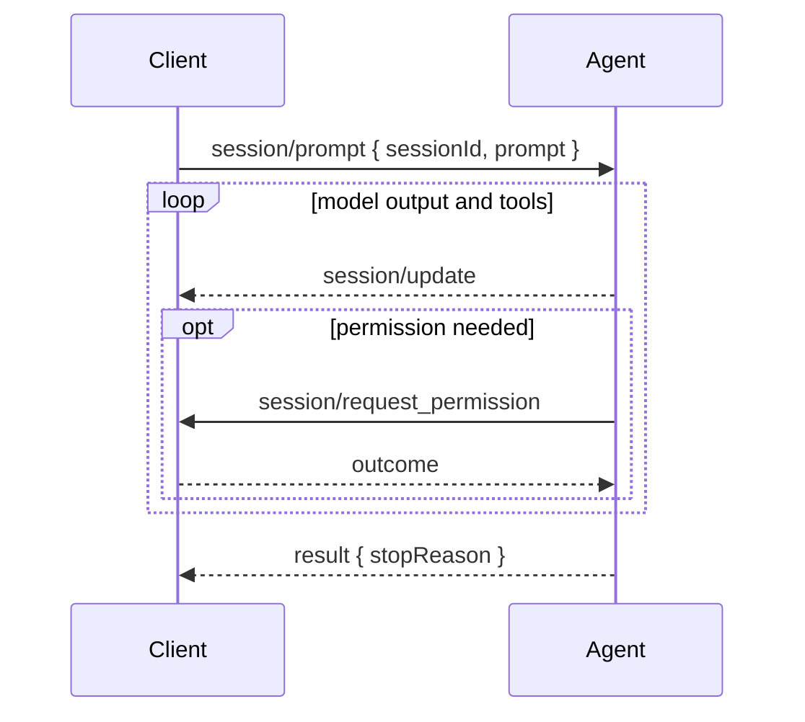

# A prompt turn streams updates until one final stop reason

After [initialization](initialization.md) and [session setup](sessions.md), the client sends `session/prompt` with a `sessionId` and a required `prompt: ContentBlock[]`; the content types must fit the prompt capabilities negotiated at startup ([prompt turn, L21–L33](https://agentclientprotocol.com/protocol/v1/prompt-turn)). The agent then emits zero or more `session/update` notifications. Their `params.update.sessionUpdate` discriminator covers streamed content, tool activity, and session-state changes; updates can also occur outside a turn, notably while replaying a loaded session ([prompt turn, L11–L19](https://agentclientprotocol.com/protocol/v1/prompt-turn)).

The stable v1 stop reasons are `end_turn`, `max_tokens`, `max_turn_requests`, `refusal`, and `cancelled`, respectively meaning normal completion, token exhaustion, too many model requests, agent refusal, and client cancellation ([prompt turn, L87–L98](https://agentclientprotocol.com/protocol/v1/prompt-turn)).

Cancellation is a notification, not a request: the client may send `session/cancel`, immediately mark unfinished tool calls cancelled, and answer pending permission requests with `cancelled`. The agent should abort model and tool work, may still emit final updates, but must send them **before** completing the original `session/prompt` with `stopReason: "cancelled"` ([prompt turn, L100–L125](https://agentclientprotocol.com/protocol/v1/prompt-turn)). This ordering lets the client safely accept late tool updates without confusing them with the next turn.